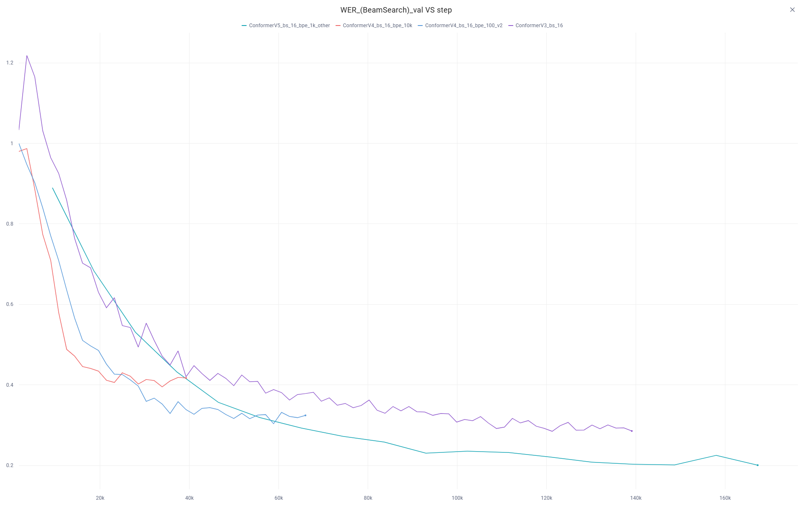

# Автоматическое распознавание речи (ASR)

Этот репозиторий содержит реализацию системы распознавания речи на базе архитектуры Conformer-CTC, выполненную в рамках домашнего задания курса DLA HSE.

## Финальный отчет

### 1. Воспроизводимость
Для запуска инференса или обучения:
1.  Установка зависимостей:
   ```
    pip install -r requirements.txt
   ```
    
2.  Загрузка весов:
    Используйте скрипт download_weights.py (нужно подставить GDrive ID модели и токенайзера):
    ```
    python download_weights.py --model_id YOUR_ID --tokenizer_id YOUR_ID
    ```
    
3.  Обучение BPE (опционально можно и без него):
    ```
    python train_bpe.py --data_path /path/to/LibriSpeech --vocab_size 1000
    ```
    

### 2. Эволюция модели и анализ экспериментов
-   Conformer на `train-clean-100`: Базовая модель достигала ~0.3 WER. Наблюдалось переобучение из-за малого объема чистых данных, то есть в моменте трейновые данные почти идеально разбирались моделью, 
    а валидация была намного выше, но при этом всем постепенно падала
-   BPE Токенизация: 
    -   Попытка с BPE на 10k словаре и стандартным пре-токенайзером сработал в начале очень хорошо, так как WER и CER резко пошли вниз без перегиба сверху, но при этом они стали на полку(
    -   Переход на 100 словарь и Metaspace пре-токенайзер (который корректно обрабатывает пробелы) позволил модели выучить субсимвольные зависимости, ну и в целом лосс пободрее пошел ниже, чем было без BPE-энкодера.
-   Дальше я решил не тянуть одно существо за одно место и взял полный шумный датасет `train-other-500`, чтоб точно BPEшечка нормально выучилась и видно, что он пошел гораздно ниже, и я еще добавил валидацию на `dev-other`. 
    Его можно было выучить прям очень круто, но я запускал локально и на ночь ставить не хотел, так как он мешает спать от шума(( Но при всем при этом я получал с LM на декодинге и BS=5 WER 0.22-0.23 на `test-other`.

### 3. Результаты
Итоговые метрики (Argmax vs Beam Search vs Transformer LM Rescoring).

| Датасет | Метрика | Argmax | Beam Search (BS=10) | BS + LM Rescoring (BS=20) |
|---|---|---|---|---|
| test-clean | WER | 12.16% | 10.83% | 10.17% |
| test-clean | CER | 4.81% | 4.28% | 4.11% |
| test-other | WER | 25.80% | 23.88% | 22.81% |
| test-other | CER | 12.15% | 11.44% | 11.06% |

*Примечание: Использование distilgpt2 для рескоринга гипотез в Beam Search дает наилучший результат.*

### 4. Реализованные бонусы
-   BPE Токенизатор (+10): Используется библиотека tokenizers с Metaspace.
-   Языковая модель (+5): Интегрирован рескоринг через distilgpt2 от Hugging Face. Пробовал в начале kenlm, но он у меня на винде не завелся.

### 5. Особенности реализации и сложности
-   Mixed Precision: Использован bfloat16.
-   Data Loading: Была проблема, что на винде работал у меня только num_workers: 0. Я решил поставить его в 8 и все было круто: у меня утилизация карты 80%, но после 5к шагов она падает до 35%. Честно так и не разобрался какого фига.

### 6. Графики (CometML)
   Весь отчет обучения есть [здесь](https://www.comet.com/tiltovskii/pytorch-template-asr-example/view/new/panels) 

   Вот этот график круче всех, где видно, что на валидации лучше всего падает BPE 1k на train-500-other
   

---
## Инструкции шаблона

### Обучение
```
python3 train.py -cn=conformer
```

### Инференс
```
python3 inference.py -cn=conformer_bpe_inference datasets=asr writer=cometml writer.run_name=<Your run name>
```
